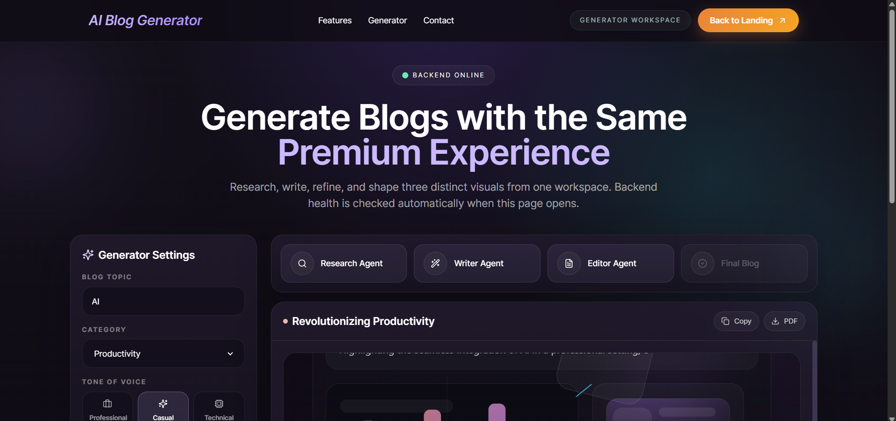
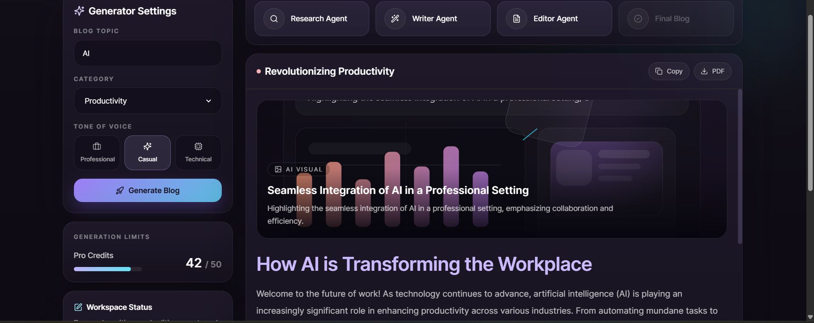
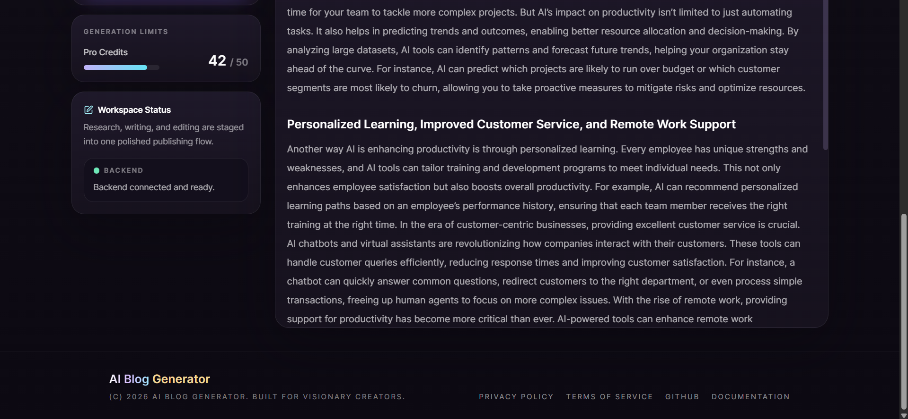
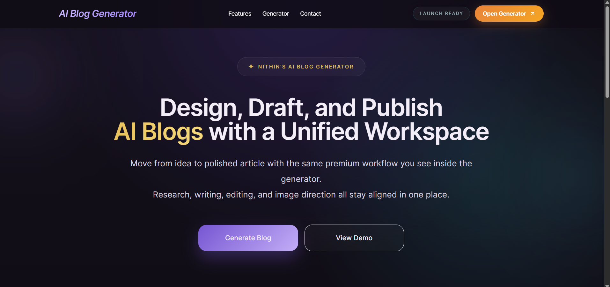
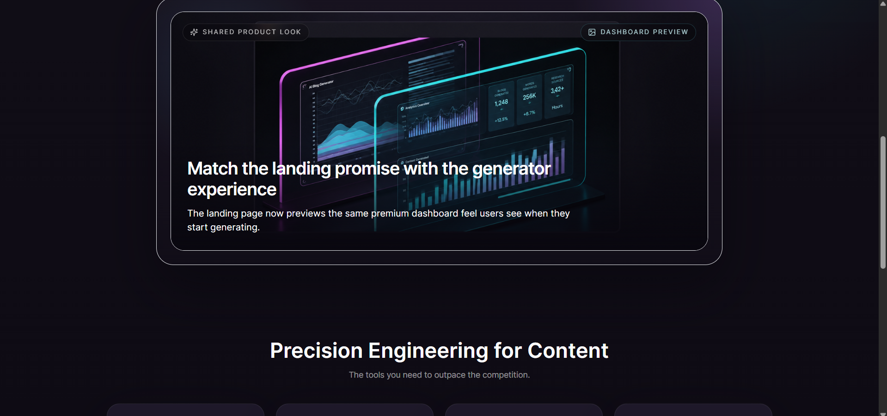
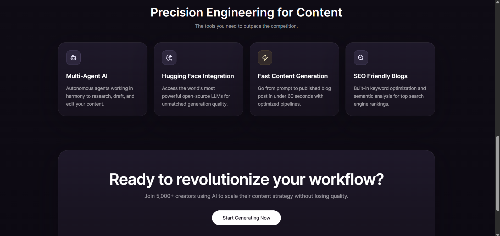

# AI Blog Generator

AI Blog Generator is a full-stack content workflow app that pairs a premium React landing page with an AI-powered blog generation workspace. Users can move from topic selection to a polished article inside one interface, while a Python backend coordinates research, writing, editing, and image prompt generation through a multi-agent CrewAI pipeline backed by Hugging Face.

## Overview

The project includes two connected experiences:

- A marketing landing page that presents the product, feature highlights, and call-to-action flow.
- A generator workspace where users enter a topic, choose a category and tone, and generate a blog article with supporting visuals.

The frontend is built with React, Tailwind CSS, Framer Motion, and `lucide-react`. The backend is a Python HTTP server that exposes health and generation endpoints, verifies the project virtual environment, and runs blog generation through CrewAI with a Hugging Face model. If live generation fails or times out, the backend returns a fallback article payload with a warning so the UI still stays usable.

## Features

- Multi-agent workflow with dedicated research, writer, and editor stages.
- Hugging Face model integration via `HF_TOKEN`.
- Polished landing page that visually matches the generator dashboard.
- Built-in backend health check before generation begins.
- Category and tone controls for blog generation.
- Copy-to-clipboard and printable PDF export actions.
- AI image prompt handling and multi-visual article presentation.
- Fallback article generation for resilience when live AI generation is unavailable.

## Tech Stack

### Frontend

- React 18
- React Router
- Tailwind CSS
- Framer Motion
- `lucide-react`
- Create React App (`react-scripts`)

### Backend

- Python
- `http.server` with `ThreadingHTTPServer`
- CrewAI
- Hugging Face API integration
- `python-dotenv`

## Project Structure

```text
ai-blog-generator/
|-- public/
|   |-- landing-hero-dashboard.png
|-- scripts/
|   |-- check_backend.py
|   |-- generate_article.py
|-- src/
|   |-- components/
|   |-- layouts/
|   |-- pages/
|   |-- services/
|   |-- App.jsx
|-- docs/
|   |-- screenshots/
|-- main.py
|-- package.json
|-- readme.md
```

## Screenshots

### Landing Page Hero



### Shared Product Preview



### Feature Cards and CTA



### Generator Workspace Overview



### Generator Controls and Article Output



### Workspace Status and Footer



## How It Works

1. The user opens the landing page and moves into the generator workspace.
2. The frontend checks `GET /api/health` to confirm the backend is running and using the project virtual environment.
3. The user enters a topic, selects a category, and chooses a tone.
4. The frontend calls `POST /api/generate`.
5. The backend runs a multi-agent flow:
   - Research Agent gathers relevant insights.
   - Writer Agent drafts the article.
   - Editor Agent polishes the article and creates image prompts.
6. The response is rendered as:
   - a dashboard label
   - the full article heading
   - an intro
   - two content sections
   - a conclusion
   - three image cards
7. The user can copy the article, print it to PDF, or regenerate it.

## API Endpoints

### `GET /api/health`

Returns backend status information including:

- `status`
- `apiVersion`
- `pythonExecutable`
- `usesProjectVenv`
- `generationTimeoutSeconds`

### `POST /api/generate`

Accepts JSON like:

```json
{
  "topic": "AI in modern workplace productivity",
  "category": "Productivity",
  "tone": "Professional",
  "imageBriefs": [
    "Hero visual with analytics overlays",
    "Editorial supporting image with charts",
    "Closing visual showing publishing workflow"
  ]
}
```

Returns an article payload with content sections and image data for the UI.

## Local Setup

### 1. Install frontend dependencies

```bash
npm install
```

### 2. Prepare a Python virtual environment

```bash
python -m venv venv
venv\Scripts\activate
```

### 3. Install backend dependencies

This repository does not currently include a `requirements.txt`, so install the backend packages in the project virtual environment before starting the server.

```bash
pip install crewai python-dotenv
```

If your CrewAI setup needs additional provider dependencies, install those in the same environment as well.

### 4. Add environment variables

Create a `.env` file in the project root and add your Hugging Face token:

```env
HF_TOKEN=your_hugging_face_token
GENERATION_TIMEOUT_SECONDS=120
```

The backend also accepts `HUGGINGFACE_API_TOKEN` or `HUGGINGFACEHUB_API_TOKEN`.

### 5. Start the backend

```bash
python main.py
```

### 6. Start the frontend

Open a second terminal and run:

```bash
npm start
```

The React app runs on the default Create React App port and proxies API requests to `http://127.0.0.1:8000`.

## Available Scripts

- `npm start` starts the React development server.
- `npm run build` creates a production build.
- `npm run test` runs the React test command.
- `npm run backend` starts the Python backend using the project virtual environment.
- `npm run verify-backend` runs a backend health and generate smoke test.

## UI Highlights

- Sticky navigation with route-aware CTA switching between landing and dashboard views.
- Premium dark theme with gradient treatments and glass-style cards.
- Landing page hero copy aligned with the product dashboard look.
- Generator sidebar with topic, category, and tone controls.
- Workflow stepper for research, writing, editing, and final output.
- Scrollable blog output panel with image cards, copy, PDF, and regenerate actions.

## Reliability Notes

- The backend checks whether it is running from the project virtual environment.
- CrewAI local storage is redirected into `.crewai_storage/` inside the repository.
- If model output is malformed, the backend attempts to coerce and recover a usable article structure.
- If generation fails or exceeds the timeout, the app returns a fallback article payload instead of a blank result.

## Future Improvements

- Add a `requirements.txt` or `pyproject.toml` for reproducible backend installs.
- Add deployment instructions for the frontend and backend.
- Replace placeholder footer links with live project resources.
- Add automated tests for the React UI and backend endpoints.

